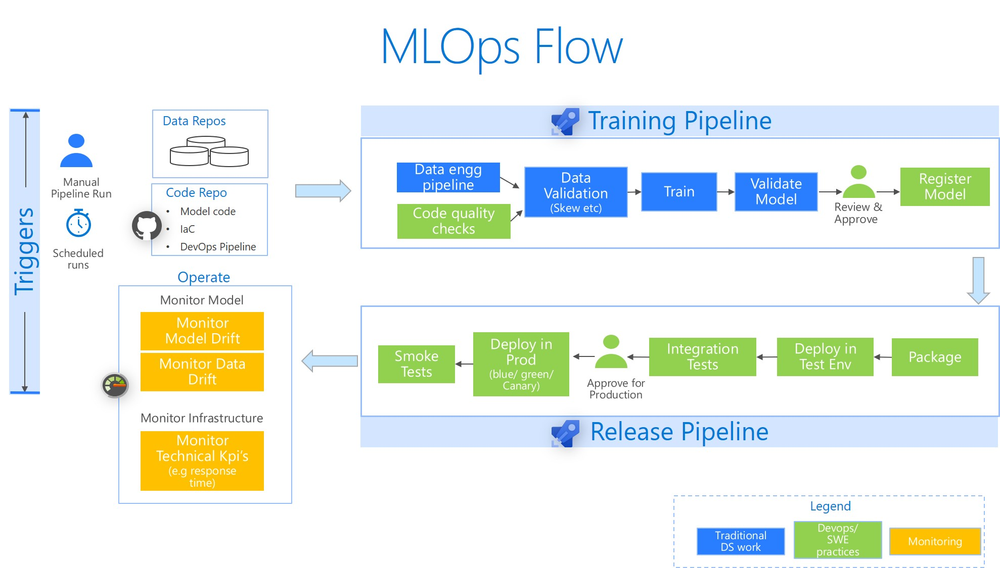

# MLOps Recipes

A library of minimalistic & modular recipes. Easily compose your custom end to end CI/CD pipelines for Machine Learning

Check out the [Project website](https://rsethur.github.io/MLOps/) for more details

__Status__: [Project board](https://github.com/rsethur/MLOps/projects/1)

__Technologies__: Azure Machine Learning & Azure Devops

__Get Started__
1. Check out the [Project website](https://rsethur.github.io/MLOps/) 
2. [Setup the environment](docs/Setup.md)
3. [Run an end to end MLOps pipeline](docs/StartBaseScenario.md)

_Note: Automated builds based on code/asset changes have been disabled by setting `triggers: none` in the pipelines. The reason is to avoid triggering accidental builds during your learning phase._

__MLOps Flow__

  __Notes on our Base scenario:__
1. Directory Structure
    1. `mlops` contains the devops pipelines
        1. `model_pipelines` contains individual pipelines for each of the models. These leverage the recipes
        2. `recipes`: contains parameterized, reusable devops pipeline for different scenarios
    2. `models` directory has the source code for the individual models (training, scoring etc)
    3. `setup` directory contains documentation on usage
2. Training: For training we use a simple LogisticRegression model on the German Credit card dataset. We build sklearn pipeline that does feature engineering. We export the whole pipeline as a the model binary (pkl file).
3. We use Azure ML CLI as a mechanism for interacting with Azure ML due to simplicity reasons.

__Acknowledgements__
1. _[MLOpsPython](https://github.com/microsoft/MLOpsPython/) python repo was one of the inspirations for this - thanks to the contributors_
2. _[German Creditcard Dataset](https://archive.ics.uci.edu/ml/datasets/Statlog+%28German+Credit+Data%29)_
 `Dua, D. and Graff, C. (2019). UCI Machine Learning Repository [http://archive.ics.uci.edu/ml]. Irvine, CA: University of California, School of Information and Computer Science.`

